# agent-java-spock

## Latest version
[  ](https://bintray.com/epam/reportportal/agent-java-spock/_latestVersion)

## Video Tutorial for integration of SPOCK on Groovy
[](https://www.youtube.com/watch?v=Rkm8dpTZur8)

# ReportPortal integration with Spock instructions

This manual will walk you through the steps for integration of ReportPortal with Spock + Geb based project

> Links to documentation for [Spock](http://spockframework.org/spock/docs/1.1/all_in_one.html) and [Geb](https://gebish.org/manual/1.0/)

This manual provides instructions for ReportPortal integration from scratch. If you want to integrate ReportPortal with existing project, go to [step 4](#step-4---add-reportportal-appender-to-logging-framework)

First, make sure you have installed ReportPortal, the installation steps could be found [here](http://reportportal.io/docs/Installation-steps)

We’ll assume that ReportPortal is installed and running on <http://localhost:8080>

## Step 1 - Create new project (Gradle)

#### 1.1 Start new Gradle project

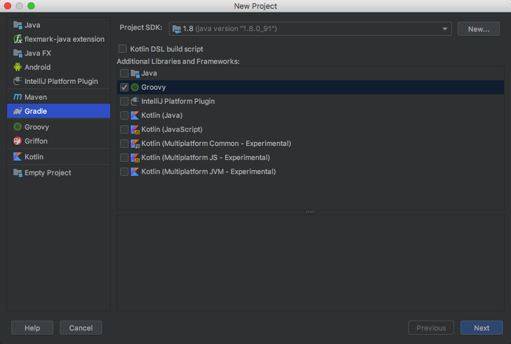

#### 1.2 Enter GroupId and ArtifactId

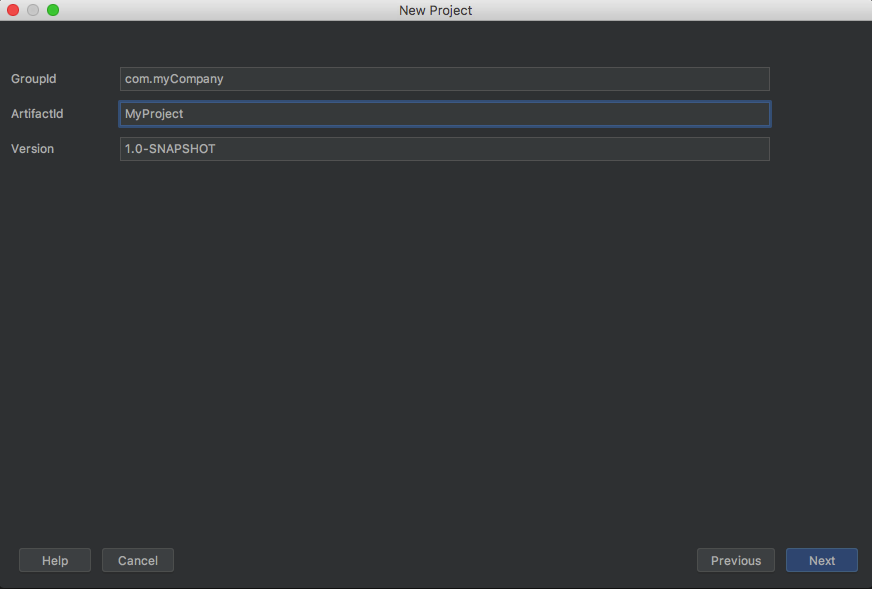

#### 1.3 Enter project name

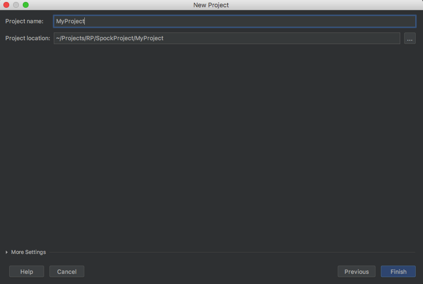

## Step 2 - Configure `build.gradle` file

For convenience, let's add following `ext` section into our `build.gradle` file:
```gradle
ext {
    // The drivers we want to use
    drivers = ["chrome", "firefox", "ie"]

    ext {
        groovyVersion = '2.4'
        gebVersion = '1.0'
        seleniumVersion = '3.0.1'
    }
}
```
Now we can use the `*Version` variables in `dependencies` section. And also we listed the browsers we are going to run tests on


#### 2.1 Add following repositories:

```gradle
repositories {
    jcenter {
        url 'https://dl.bintray.com/epam/reportportal'
    }
    mavenCentral()
}
```

#### 2.2 Add following dependencies:

*ReportPortal agent implementation for Spock framework*
```gradle
testCompile 'com.epam.reportportal:agent-java-spock:2.6.0'
```

> Latest version of the agent, could be found [here](https://bintray.com/epam/reportportal/agent-java-spock)

*ReportPortal java client*
```gradle
compile 'com.epam.reportportal:client-java-core:2.7.1'
```
*Selenium support*
```gradle
testCompile "org.seleniumhq.selenium:selenium-support:$seleniumVersion"
```
*Support for dedicated browser driver(s)*

```gradle
testCompile "org.seleniumhq.selenium:selenium-chrome-driver:$seleniumVersion"
testCompile "org.seleniumhq.selenium:selenium-firefox-driver:$seleniumVersion"
testCompile "org.seleniumhq.selenium:selenium-ie-driver:$seleniumVersion"
```

*Groovy and Geb*
```gradle
testCompile "org.gebish:geb-spock:$gebVersion"
testCompile "org.gebish:geb-junit4:$gebVersion"
testCompile "org.codehaus.groovy:groovy-all:$groovyVersion"
```
*Spock framework dependency*
```gradle
testCompile ("org.spockframework:spock-core:1.0-groovy-2.4") {
    exclude group: "org.codehaus.groovy"
}
```

#### 2.3 Add ReportPortal dedicated logger wrapper
ReportPortal provides it's own logger implementation for major logging frameworks like *log4j* and *logback*

If you prefer using *Logback* logging library, add following dependencies:

*ReportPortal logback logger dependency*
```gradle
testCompile 'com.epam.reportportal:logger-java-logback:2.6.0'
```

> Up to date version could be found [here](https://bintray.com/epam/reportportal/logger-java-logback)

*The logback itself*
```gradle
compile group: 'ch.qos.logback', name: 'logback-classic', version: '1.2.2'
```

If you prefer using *Log4j* logging library, add following dependencies:

*ReportPortal log4j logger dependency*
```gradle
testCompile 'com.epam.reportportal:logger-java-log4j:4.0.1'
```
> Up to date version could be found [here](https://bintray.com/epam/reportportal/logger-java-log4j)

*The log4j itself*
```gradle
compile group: 'org.apache.logging.log4j', name: 'log4j-api', version: '2.10.0'
compile group: 'org.apache.logging.log4j', name: 'log4j-core', version: '2.10.0'
```

#### 2.4 Create gradle tasks for tests

Use the following code to make dedicated tasks for each browser type listed in the `ext` section

```gradle
drivers.each { driver ->
    task "${driver}Test" (type: Test) {
        reports {
            html.destination = reporting.file ("$name/tests")
            junitXml.destination = file ("$buildDir/test-results/$name")
        }

        outputs.upToDateWhen { false }  // Always run tests

        systemProperty "geb.build.reportsDir", reporting.file ("$name/geb")
        systemProperty "geb.env", driver
    }
}

test {
    dependsOn drivers.collect { tasks["${it}Test"] }
    enabled = false
}
```
After adding this code and rebuilding the project, you should see newly added tasks in the gradle toolbar of the IDE:
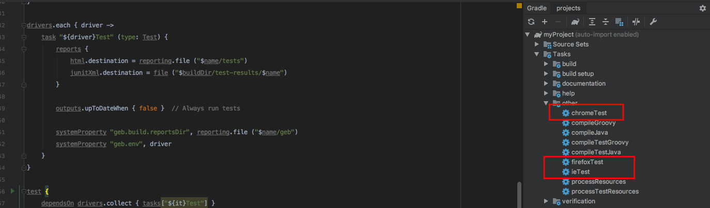

By this moment your `build.gradle` file should look somewhat like that:

```gradle
[build.gradle]

ext {
    // The drivers we want to use
    drivers = ["chrome", "firefox", "ie"]

    ext {
        groovyVersion = '2.4'
        gebVersion = '1.0'
        seleniumVersion = '3.0.1'
    }
}

apply plugin: "groovy"

repositories {
    jcenter {
        url 'https://dl.bintray.com/epam/reportportal'
    }
    mavenCentral()
}

dependencies {
    testCompile 'com.epam.reportportal:agent-java-spock:2.6.0'
    testCompile 'com.epam.reportportal:logger-java-logback:2.6.0'
    compile 'com.epam.reportportal:client-java-core:2.7.1'

    testCompile "org.seleniumhq.selenium:selenium-support:3.0.1"
    testCompile "org.gebish:geb-spock:$gebVersion"
    testCompile "org.gebish:geb-junit4:$gebVersion"
    testCompile "org.codehaus.groovy:groovy-all:$groovyVersion"

    testCompile ("org.spockframework:spock-core:1.0-groovy-2.4") {
        exclude group: "org.codehaus.groovy"
    }

    testCompile "org.seleniumhq.selenium:selenium-chrome-driver:$seleniumVersion"
    testCompile "org.seleniumhq.selenium:selenium-firefox-driver:$seleniumVersion"
    testCompile "org.seleniumhq.selenium:selenium-ie-driver:$seleniumVersion"

    compile group: 'ch.qos.logback', name: 'logback-classic', version: '1.2.2'
}

drivers.each { driver ->
    task "${driver}Test" (type: Test) {
        reports {
            html.destination = reporting.file ("$name/tests")
            junitXml.destination = file ("$buildDir/test-results/$name")
        }

        outputs.upToDateWhen { false }  // Always run tests

        systemProperty "geb.build.reportsDir", reporting.file ("$name/geb")
        systemProperty "geb.env", driver
    }
}

test {
    dependsOn drivers.collect { tasks["${it}Test"] }
    enabled = false
}

```

## Step 3 - Configure Geb

Now we need to configure Geb framework. To do this, add `GebConfig.groovy` file to the `resources` folder

```groovy
[resources/GebConfig.groovy]

import geb.report.ScreenshotReporter
import org.openqa.selenium.chrome.ChromeDriver
import org.openqa.selenium.firefox.FirefoxDriver
import org.openqa.selenium.ie.InternetExplorerDriver
import org.openqa.selenium.remote.DesiredCapabilities
import utils.RpScreenshotListener

baseUrl = "https://www.google.com/ncr"
reportsDir = new File ("target/runtime_reports_dir")

waiting {
    timeout = 20
}

System.setProperty ("webdriver.gecko.driver", getFullPathToDriver("geckodriver"))
System.setProperty ("webdriver.chrome.driver", getFullPathToDriver("chromedriver"))
System.setProperty ("webdriver.ie.driver", getFullPathToDriver("IEDriverServer"))

environments {

    chrome {
        driver = { new ChromeDriver () }
    }

    firefox = {
        driver = { new FirefoxDriver () }
    }

    ie {
        def capabilities = DesiredCapabilities.internetExplorer ()
        capabilities.setCapability(InternetExplorerDriver.IE_ENSURE_CLEAN_SESSION, true)
        driver = { new InternetExplorerDriver (capabilities) }
    }
}

private static boolean isWindows() {
    String os_name = System.getProperty("os.name").toLowerCase()
    return os_name.startsWith("win")
}

private static String getFullPathToDriver(String driverFileName) {
    String extension = isWindows() ? ".exe" : ""
    def path = "drivers${File.separatorChar}$driverFileName$extension"
    new File(path).absolutePath
}
```

Pay attention to `baseUrl` property - this url Geb will open by default when getting request to open a page

## Step 4 - Add ReportPortal appender to logging framework

In order to enable and configure logging, we need to add the appropriate config file to the `resources` folder, in case of `logback` library, we should create `logback.xml` file and add ReportPortal appender there:

```xml
[resources/logback.xml]

<configuration>
   <appender name="STDOUT" class="ch.qos.logback.core.ConsoleAppender">
      <encoder>
         <pattern>%d{HH:mm:ss.SSS} %-5level %logger{5} - %thread - %msg%n</pattern>
      </encoder>
   </appender>

   <appender name="ReportPortalAppender" class="com.epam.reportportal.logback.appender.ReportPortalAppender">
      <encoder>
         <pattern>%d{HH:mm:ss.SSS} [%t] %-5level - %msg%n</pattern>
      </encoder>
   </appender>

   <root level="DEBUG">
      <appender-ref ref="ReportPortalAppender" />
      <appender-ref ref="STDOUT" />
   </root>
</configuration>
```

## Step 5 - Create simple test

In this manual we'll add a small test, which opens "google.com", makes a search and then checks that search results are not empty. We'll use Spock and Geb for this purposes

#### 5.1 Create page object classes (with Geb)

First of all, let's make page objects for Google pages
We'll need 2 pages: Google's start page and the search results page:

```groovy
[MyProject/src/test/groovy/page/GoogleStartPage]

package page

import geb.Page
import org.openqa.selenium.Keys

class GoogleStartPage extends Page {

    static at = {
        title == "Google"
    }

    static content = {
        searchInput(wait: true) { $ ("input[name='q']") }
    }

    def search(String searchCriteria) {
        searchInput << searchCriteria
        searchInput << Keys.ENTER

        browser.isAt GoogleSearchResultsPage
    }
}
```

```groovy
[MyProject/src/test/groovy/page/GoogleSearchResultsPage]

package page

import geb.Page

class GoogleSearchResultsPage extends Page {

    static at = {
        title.matches(".+ - Google Search")
    }

    static content = {
        searchResultsTitles { $("div.rc h3") }
        searchResultsTitlesCount { searchResultsTitles.size() }
        searchInput(wait: true) { $("input[name='q']") }
    }
}
```

#### 5.2 Add the test code

Now let's add the test, following the Spock framework approach

```groovy
[MyProject/src/test/groovy/myTests/GoogleSearchTestSpec]

package myTests

import geb.spock.GebReportingSpec
import groovy.util.logging.Slf4j
import page.GoogleStartPage
import spock.lang.Unroll

@Slf4j
class GoogleSearchTestSpec extends GebReportingSpec {

    @Unroll
    def "Search for 'reportportal' returns more than #resultsCount results"(String searchCriteria, int resultsCount) {
        given: "The user is on Google Start page"
            to GoogleStartPage
        when: "Enter search criteria: $searchCriteria"
            search(searchCriteria)
        then: "Search results count is greater than $resultsCount"
            log.info("Search results count: $searchResultsTitlesCount")
            searchResultsTitlesCount > resultsCount
        where:
            searchCriteria | resultsCount
            'reportportal' | 1
    }
}
```

Since we are using groovy, we can benefit from it's features like automatic adding of the `log` field to the test class during compile time
To do this, we only need to add `@Slf4j` annotation to our tests class `GoogleSearchTestSpec` and the `log` field will be added

## Step 6 - Configuring ReportPortal

#### 6.1 Open ReportPortal UI

Go to *http:$IP_ADDRESS_OF_REPORT_PORTAL:8080* (by default it is *http://localhost:8080*)

Login as **Admin** user and create the project (more details [here](http://reportportal.io/docs/Deploy-ReportPortal) and [here](http://reportportal.io/docs/Creation-of-project))

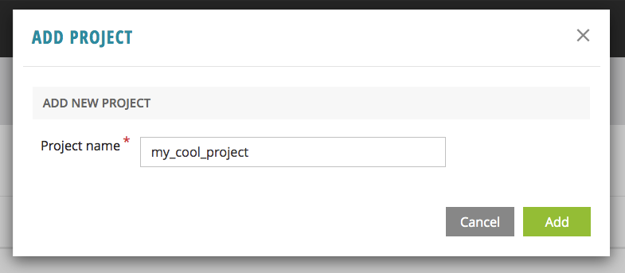

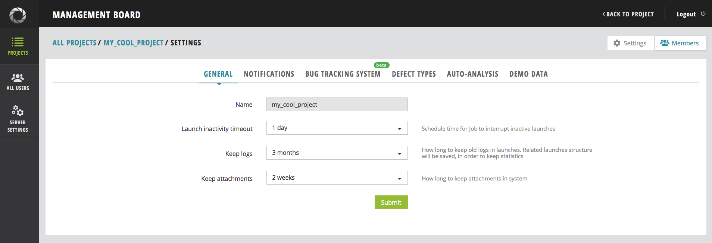

#### 6.2 Add users to your project:

Go to *Administrative* -> *My Test Project* -> *Members* -> *Add user*
> Example link *http://localhost:8080/ui/#administrate/project-details/my_test_project/members*

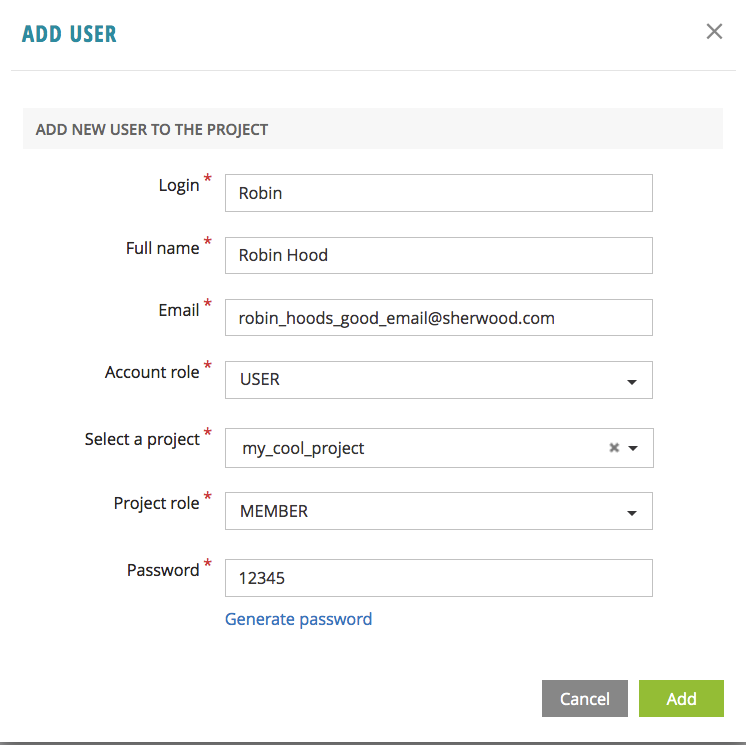

## Step 7 - Link ReportPortal with your tests

#### Step 7.1 - Add `reportportal.properties`

After you have created new user in your project, you can get `reportportal.properties` file example from the user *Profile* page

To do that, login as created user and go to *User icon* in header -> *Profile*

There, in *Configuration Examples* section, you can find the example of `reportportal.properties` file for that user

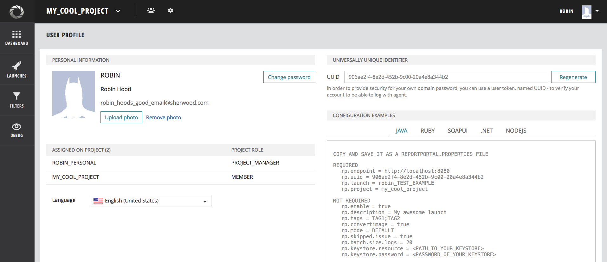

Returning back to the code. In your project, create file named `reportportal.properties` in `resources` folder and copy&paste the contents form the user profile page

```properties
[resources/reportportal.properties]

rp.endpoint = http://localhost:8080
rp.uuid = 4aca8475-c4b4-4904-ae2d-c954897e9b62
rp.launch = robin_tests
rp.project = my_cool_project
rp.enable = true
```

> More details on `reportportal.properties` file could be found [here](http://reportportal.io/docs/JVM-based-clients-configuration)

By this moment, your project tree should look somewhat like the this:

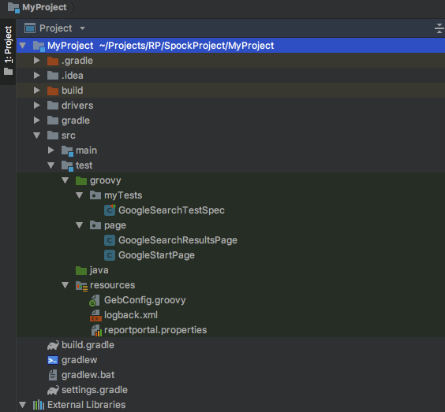

#### Step 7.2 - Make ReportPortal agent invoked by the tests

Now we need to link ReportPortal agent with our tests, and there are multiple ways for doing that:

For tests based on Spock framework, there is a way to attach listener to the tests via java service loader approach
To do this, we need to create the same file structure as in the Spock library:

*The Spock framework Global Extensions folder*
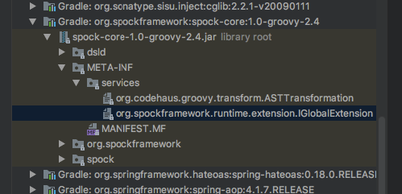

And we need to replicate the same file structure in `resources` folder of our project:
*Replication of the Spock framework Global Extensions folder in resources folder of the project*

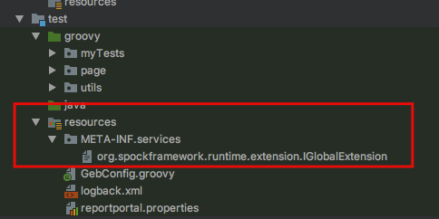

Path to file that should be created in the project:
```shell
.../MyProject/src/test/resources/META-INF/services/org.spockframework.runtime.extension.IGlobalExtension
```

It's also needed to edit this file and include *ReportPortalSpockExtension*:

```shell
com.epam.reportportal.spock.ReportPortalSpockExtension
```

Now the ReportPortal agent is linked to the tests and when the tests are executed, the results should be sent to ReportPortal

## Step 8 - Observing test run report

After we linked the ReportPortal agent with Spock and ran the tests, we should be able to see the results in the ReportPortal UI instance

The launch should be found there, with the name matching the value of `rp.launch` property from your `reportportal.properties` file

*Example:*

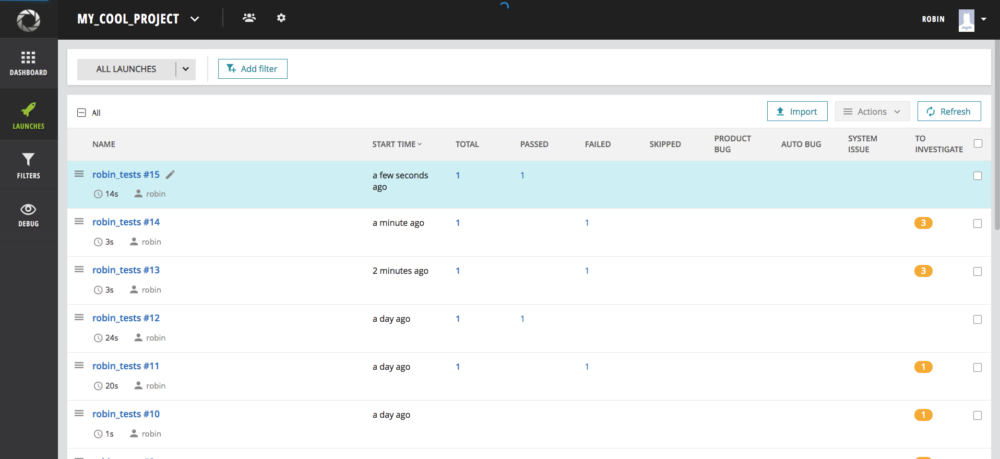

You can also see the test classes and individual test results by clicking on the launch name and going deeper

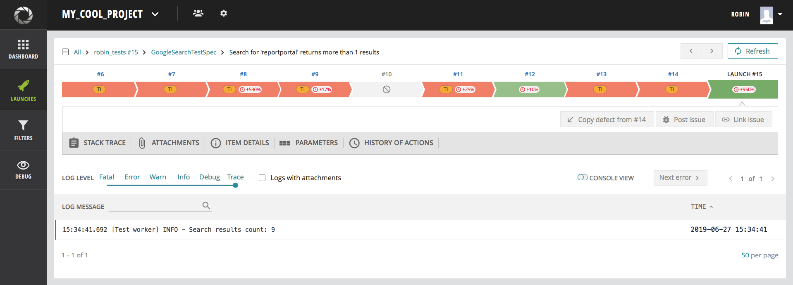

The logs from the test are also shown

## Step 9 - Attaching screenshots

In order to make ReportPortal showing the screenshots captured during the test, we need to first capture the screenshot file and then log the bytes of that screenshot with the specific type.

#### 9.1 Capturing the screenshot
Geb comes with screenshot capturing feature out of the box and by default it captures page screenshot if the test fails.
To make these screenshots attached to the test report in ReportPortal we need to implement our own listener to intercept the `onReport` method and send the taken screenshot to ReportPortal

#### 9.2 Logging the screenshot to ReportPortal
To do that, add the following `RpScreenshotListener` class in `test/groovy/utils` folder:

```groovy
[test/groovy/utils/RpScreenshotListener]

package utils

import com.google.common.io.BaseEncoding
import com.google.common.io.Resources
import geb.report.ReportState
import geb.report.Reporter
import geb.report.ReportingListener
import geb.report.ScreenshotReporter
import groovy.util.logging.Slf4j


@Slf4j
class RpScreenshotListener implements ReportingListener {

    @Override
    void onReport(Reporter reporter, ReportState reportState, List<File> reportFiles) {
        if (reporter instanceof ScreenshotReporter) {
            def content = Resources.asByteSource(reportFiles.first().toURI().toURL()).read()
            log.debug("RP_MESSAGE#BASE64#${BaseEncoding.base64().encode(content)}#${reportState.label}")
        }
    }
}

```
Here we log base64 encoded screenshot bytes with the specific log type `RP_MESSAGE`

By doing this, the screenshots taken by Geb will also be attached to the ReportPortal test report
> official documentation [reference](https://gebish.org/manual/current/#listening-to-reporting) for `onReport` listener

If we want Geb to capture additional screenshots during the test steps (not only during test failures), we can use `report()` method using the following format:

```groovy
report "<screenshot heading>"
```
> official documentation [reference](https://gebish.org/manual/current/#reporting) for `report()` method

Let's add the screen capture of the Google's start page to our test, using this approach

```groovy
[MyProject/src/test/groovy/myTests/GoogleSearchTestSpec]

package myTests

import geb.spock.GebReportingSpec
import groovy.util.logging.Slf4j
import page.GoogleStartPage
import spock.lang.Unroll

@Slf4j
class GoogleSearchTestSpec extends GebReportingSpec {

    @Unroll
    def "Search for 'reportportal' returns more than #expectedSearchResultsCount results"(String searchCriteria, int expectedSearchResultsCount) {
        given: "The user is on Google Start page"
            to GoogleStartPage
            report "Google.com start page" // should make a screenshot here
        when: "Enter search criteria: $searchCriteria"
            search(searchCriteria)
        then: "Search results count is greater than $expectedSearchResultsCount"
            log.info("Search results count: $searchResultsTitlesCount")
            searchResultsTitlesCount > expectedSearchResultsCount
        where:
            searchCriteria | expectedSearchResultsCount
            'reportportal' | 1
    }
}
```

Finally, in order to make our listener work, we need to initialize the Geb's screenshot reporting class `ScreenshotReporter` and also the listener that we've just added - `RpScreenshotListener`
There are multiple places/stages where it can be initialized. One of them is the `GebConfig.groovy` file, and in this case, the `ScreenshotReporter` and our `RpScreenshotListener` will be initialized along with the configuration

```groovy
[resources/GebConfig.groovy]

import geb.report.ScreenshotReporter
import org.openqa.selenium.chrome.ChromeDriver
import org.openqa.selenium.firefox.FirefoxDriver
import org.openqa.selenium.ie.InternetExplorerDriver
import org.openqa.selenium.remote.DesiredCapabilities
import utils.RpScreenshotListener

baseUrl = "https://www.google.com/ncr"
reportsDir = new File ("target/runtime_reports_dir")

waiting {
    timeout = 20
}

System.setProperty ("webdriver.gecko.driver", getFullPathToDriver("geckodriver"))
System.setProperty ("webdriver.chrome.driver", getFullPathToDriver("chromedriver"))
System.setProperty ("webdriver.ie.driver", getFullPathToDriver("IEDriverServer"))

environments {

    chrome {
        driver = { new ChromeDriver () }
    }

    firefox = {
        driver = { new FirefoxDriver () }
    }

    ie {
        def capabilities = DesiredCapabilities.internetExplorer ()
        capabilities.setCapability(InternetExplorerDriver.IE_ENSURE_CLEAN_SESSION, true)
        driver = { new InternetExplorerDriver (capabilities) }
    }
}

private static boolean isWindows() {
    String os_name = System.getProperty("os.name").toLowerCase()
    return os_name.startsWith("win")
}

private static String getFullPathToDriver(String driverFileName) {
    String extension = isWindows() ? ".exe" : ""
    def path = "drivers${File.separatorChar}$driverFileName$extension"
    new File(path).absolutePath
}

reporter = new ScreenshotReporter()
reportingListener = new RpScreenshotListener()
```

Now we should be able to see the screenshot of the page after opening Google's start page and also in case of the test failure

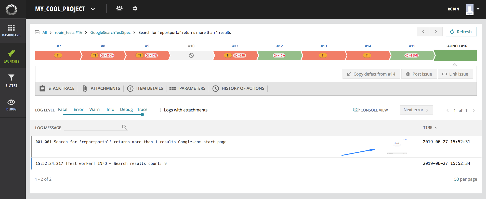

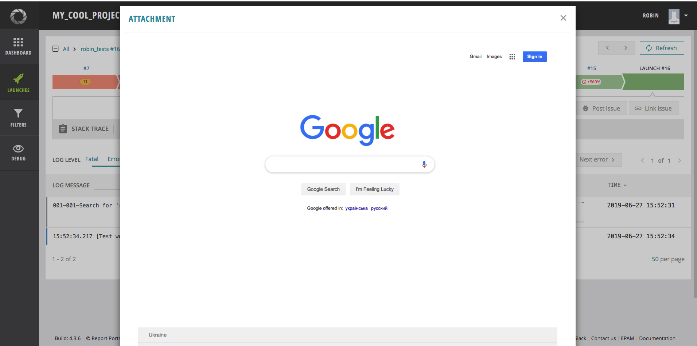
